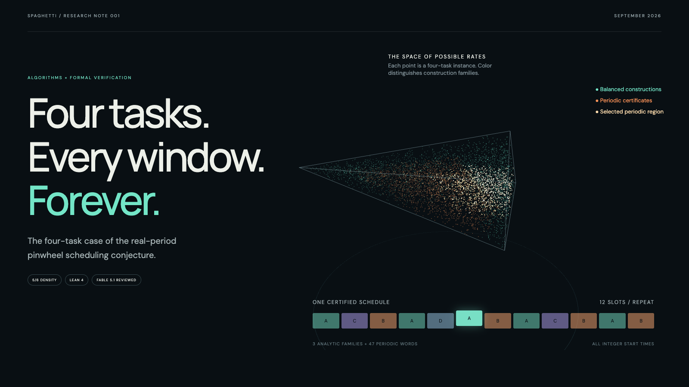

# Pinwheel Scheduling with Four Real Periods

By [spaghetti (@spaghetti_codes)](https://x.com/spaghetti_codes).

Every pinwheel instance with at most four distinct real period values and density at most 5/6 admits a valid schedule. The four-task case is formalized in Lean; standard splitting and the published smaller cases give the full statement.

For four sorted positive real periods with reciprocal sum at most **5/6**, we construct a schedule that meets **every** required frequency window, for all integer starting times.

[Paper (PDF)](paper/four-real-periods.pdf) · [LaTeX](paper/four-real-periods.tex) · [Lean theorem](CertifiedDiscovery/PinwheelPeriods.lean) · [Verification](results/verification-summary.md) · [Video](media/four-real-periods.mp4)



## What is proved

For `0 < a₀ ≤ a₁ ≤ a₂ ≤ a₃` and `1/a₀ + 1/a₁ + 1/a₂ + 1/a₃ ≤ 5/6`, there exists `S : ℤ → Fin 4` such that task i appears at least ℓ times in every window of `⌈ℓ aᵢ⌉` slots, for every positive integer ℓ.

The exact entry point is `CertifiedDiscovery.Pinwheel.four_periods_schedulable`. The Lean statement assumes sorted input. Sorting and relabeling arbitrary input is a mathematical reduction, not formalized here. The paper also proves a mathematical corollary for arbitrary multiplicities of at most four distinct values, using the established smaller cases; that corollary is not formalized.

This carries out an extension anticipated by [Fujiwara, Miyagi and Ouchi](https://dmtcs.episciences.org/18808), whose final paper proves three distinct real values and identifies four or five as future work. [Kawamura's general 5/6 theorem](https://arxiv.org/abs/2606.27104) concerns integer periods. We do not resolve the general real-period conjecture. The novelty search found no prior matching result as of September 8, 2026, but cannot exclude unpublished or unindexed work.

## Proof structure

Three balanced two-group constructions and 47 periodic words of length 12 or 18 cover the ordered rate domain. A 136-split decision tree proves continuous coverage, including strict boundaries. Finite remainder-window checks and mean bounds imply all-window guarantees for each periodic word.

The numerical and SMT searches supplied candidate certificates. Neither solver is trusted by the theorem. Lean verifies the constructions and their complete coverage.

| Files | Role |
|---|---|
| `PinwheelPeriods`, `PinwheelSchedule` | Original period semantics and actual schedule |
| `PinwheelFour` | Coverage combination and density weakening |
| `PinwheelBalanced`, `PinwheelGroups` | Balanced schedules and splitting |
| `PinwheelPeriodic`, `PinwheelTable` | Finite certificates imply infinite-window validity |
| `PinwheelTables`, `PinwheelCover` | Concrete certificates and continuous cover |
| `PinwheelWords` | Rate-cap type and additional word checks |

## Reproduce

Install [elan](https://github.com/leanprover/elan), then:

```sh
lake update
lake exe cache get
lake build
python3 experiments/verify.py
python3 experiments/check_certificates.py
```

Lean 4.33.1 and Mathlib commit `0df444a360eaa60ab8c11dca51a86af692955474` are pinned. The verifier builds the project, replays each module, replays the full imported closure with `--fresh`, and requires three corrupt production certificates to fail compilation. The files in `tests/Reject*.lean` are intentionally invalid and are not library targets.

Standard theorem axioms: `propext`, `Classical.choice`, `Quot.sound`. No proof holes, custom axioms, or `native_decide`. A module-only kernel replay trusts imports; the fresh replay additionally checks the imported closure.

## Visual and video

```sh
cd site
npm ci
npm run dev
npm run build
```

The interactive Three.js illustration shows sampled points in the ordered density-5/6 domain, classified by the certified constructions. The point cloud is explanatory; it is not the proof of coverage. Use the slider to inspect different cyclic certificates. Motion can be paused and respects reduced-motion preferences.

`media/four-real-periods.mp4` is the accompanying silent 18-second video. Source and capture instructions are in `experiments/render_video.py`.

## AI use and review

Codex performed exploratory search, formalization, and drafting under spaghetti's direction. Fable 5.1 independently reviewed semantics, arithmetic, prior work, and kernel replay. Its findings prompted corrections to scope descriptions and verification controls. AI review does not replace expert peer review or establish priority. See the paper for details.

Original proof sources, code, and note: MIT license. Lean, Mathlib, Three.js, and other dependencies retain their own licenses. Please cite the original scheduling papers alongside this extension.
